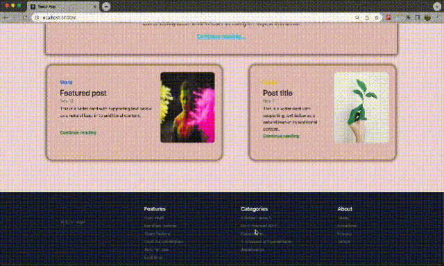

<h1> PROJECT NAME: SERVICE APP - Rebuild app with redux-toolkit </h1> 

<h2> This App created with REACT & React-Router DOM-6 - REDUX TOOLKIT and used remote Api. </h2>   

 Before, same app was created with redux. Now I used Redux Toolkit and rebuild the app that used same remote api. I used different css properties. 
  

<h3> WHICH LIBRARIES AND PACKAGES ARE USED IN THE APP? </h3>  

 1. BOOTSTRAP   
2. AXIOS  
3. REACT  
4. REACT-ROUTER-DOM-6  
5. REMOTE API  
6. REDUX-TOOLKIT  
  

<h3> SITE VIEW </h3>  

  
